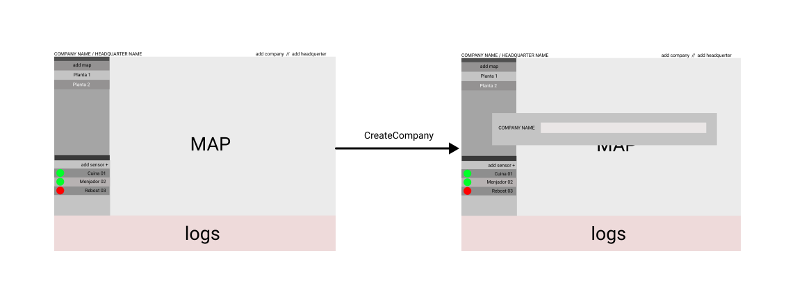
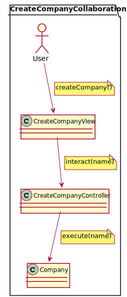

# Pestmonitors.com

Pestmonitors.com es una aplicació web d'una sola pàgina (o SPA Single Page Application) per gestionar dispositius de hardware desenvolupats per la indústria/sector del control de plagues. Els dispositius són uns sensors que envien alarmes a l'aplicació quan detecten la presència de rosegadors en un espai monitorat. La pàgina web desenvolupada ha d'administrar tota la gestió d'aquests sensors. 

El present document agrupa les diferents parts del projecte software. S'utilitzarà Rational Unified Process (RUP) pel procés de desenvolupament. Es tracta d'un procés dirigit per casos d'usos i centrat en l'arquitectura. Els casos d'usos recullen els requisits funcionals de l'aplicació, i l'arquitectura defineix la manera que s'estructurarà èls elements del software. Aquest procés s'organitza en 5 disciplines:
 * Disciplina de requisists
 * Disciplina d'anàlisis
 * Disciplina de disseny
 * Disciplina d'implementació
 * Disciplina de proves

## DISCIPLINA DE REQUISITS
La disciplina de requisits se centra a cercar actors i els casos d'usos, i també en prioritzar, detallar i estructurar aquests casos d'usos. S'utilitzarà un model del domini per definir les paraules i conceptes generals, així com definir les relacions més rellevants. 

### Domain model

### Use Cases
Diagrama dels casos d'ús que ha de satisfer la primera versió del projecte. 

### Use case context
Diagrama on es contextualitzen tots els casos d'ús que es proposen a la primera versió del projecte. 

### Use case CreateCompany specification
Diagrama d'especificació del cas d'us de la creació de una empresa. Definim l'intercanvi d'informació entre l'actor i el sistema, transitant en estats de l'aplicació. 

### Interface prototype
Prototips d'interfaces i relacions. Example de relació entre la vista principal (main) i la de CreateCompany 

## DISCIPLINA D'ANALISIS
La disciplina d'anàlisis s'analitzà l'arquitectura, els casos d'usos (mitjançant diagrames de colaboració), les clases i els paquets. 

### Architecture
Diagrama dels paquets model/vista/controladors.

### Use cases analysis
Diagrames amb les colaboracions (missatges) entre les vistes, controladors i models. Això brinda traçabilitat a cada cas d'ús, deixen clar quin impacte pot tenir qualsevol canvi al futur. 

