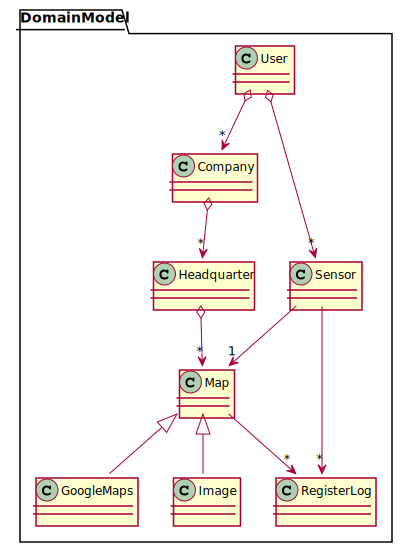
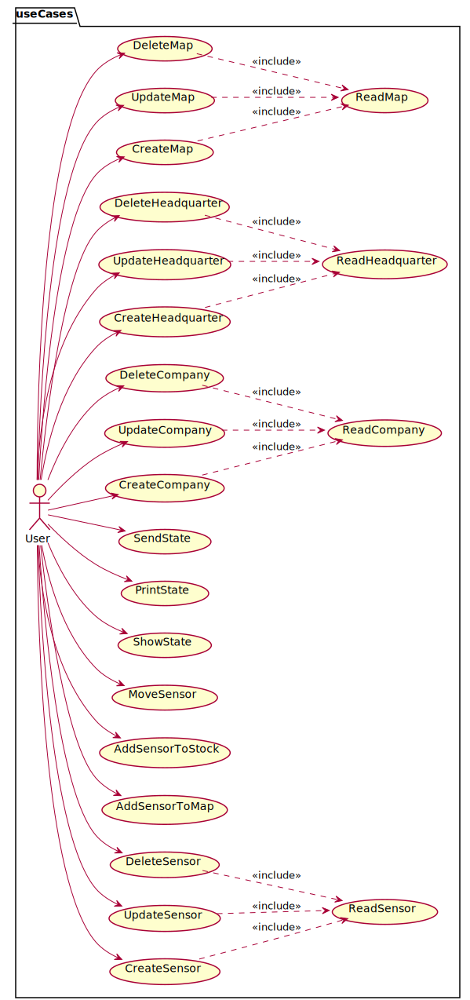
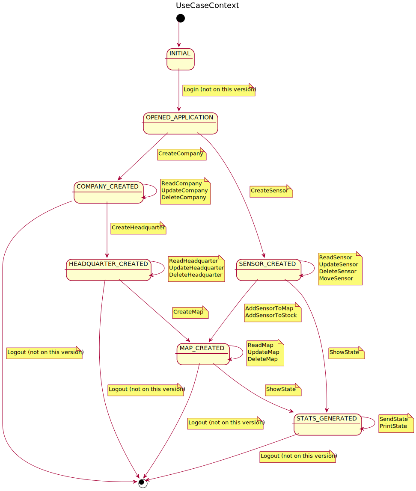
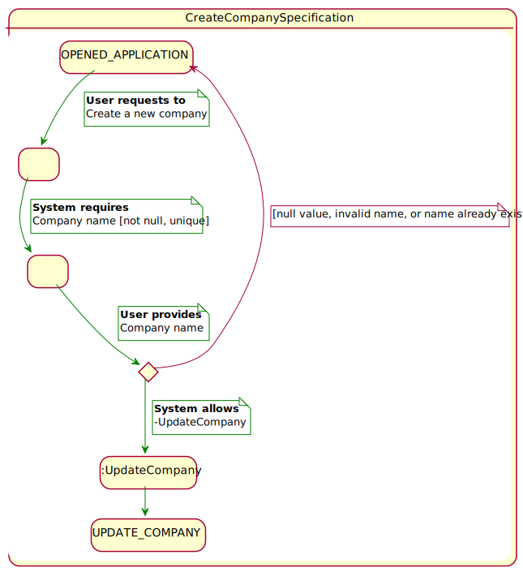
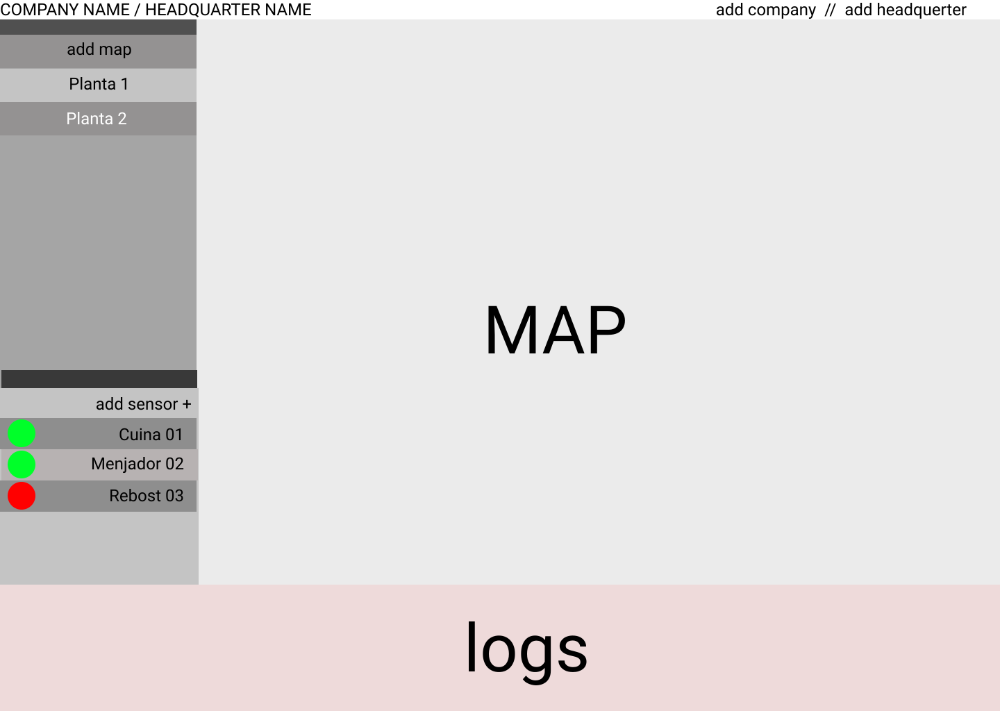
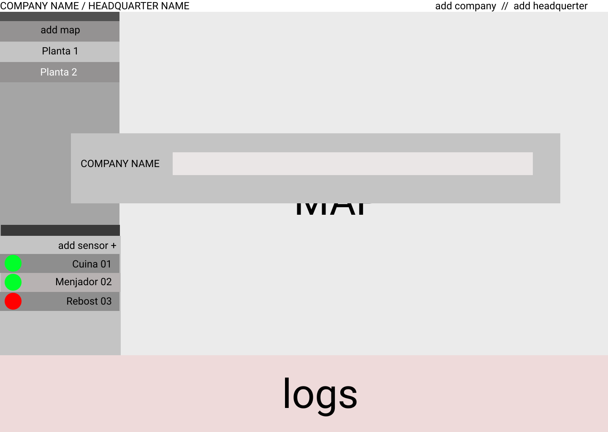
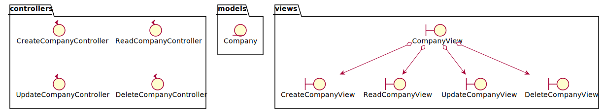

# Pestmonitors.com

Pestmonitors.com es una aplicació web d'una sola pàgina (o SPA Single Page Application) per controlar dispositius desenvolupats per la indústria/sector del control de plagues. Es tracta d'uns sensors que avisen de la presència de rosegadors en un espai monitorat. La pàgina web ha d'administrar tota la gestió d'aquests sensors. 

El present document agrupa els diferents diagrames del projecte software, on s'utilitzarà Rational Unified Process (RUP) per el proces de desenvolupament.

## DISCIPLINA DE REQUISITS

### Domain model
Diagrama del model del domini de la aplicació on es defineix paraules i conceptes generals. 

### Use Cases
Diagrama dels casos d'ús que ha de satisfer la primera versió del projecte. 

### Use case context
Diagrama on es contextualitzen tots els casos d'ús que es proposen a la primera versió del projecte. 

### Use case CreateCompany specification
Diagrama d'especificació del cas d'us de la creació de una empresa. Definim l'intercanvi d'informació entre l'actor i el sistema, transitant en estats de la aplicació. 

### Interface prototype
Prototips d'interfaces i relacions 

##DISCIPLINA D'ANALISIS

###Architecture
Diagrama de paquets

