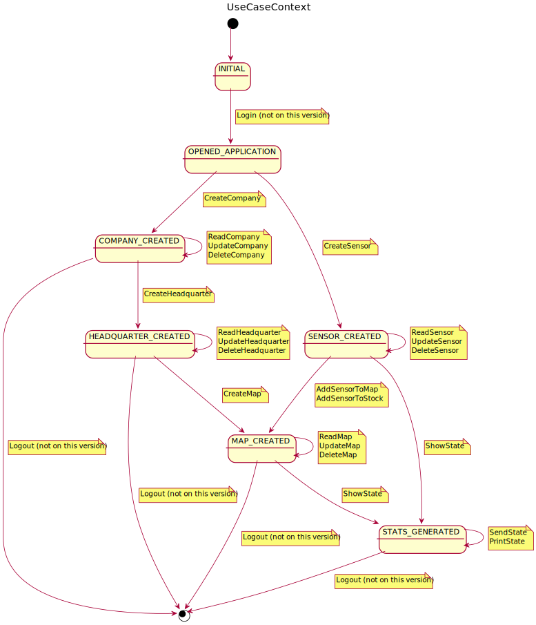

# Pestmonitors.com

Pestmonitors.com es una aplicació web d'una sola pàgina (o SPA Single Page Application) per controlar uns dispositius de hardware desenvolupats per la indústria/sector del control de plagues. Es tracta d'uns sensors que avisen de la presència de rosegadors en un espai monitorat, i la pàgina web ha d'administrar tota la gestió d'aquests sensors.

El present document agrupa els diferents diagrames del projecte software, on s'utilitzará Rational Unified Process (RUP) per el proces de desenvolupament.

### Domain model
Diagrama del model del domini de la aplicació.

### Use Cases
Diagrama dels casos d'ús que ha de satisfer la primera versió del projecte.

### Use case context
Diagrama on es contextualitzen tots els casos d'ús que es proposen a la primera versió del projecte.

